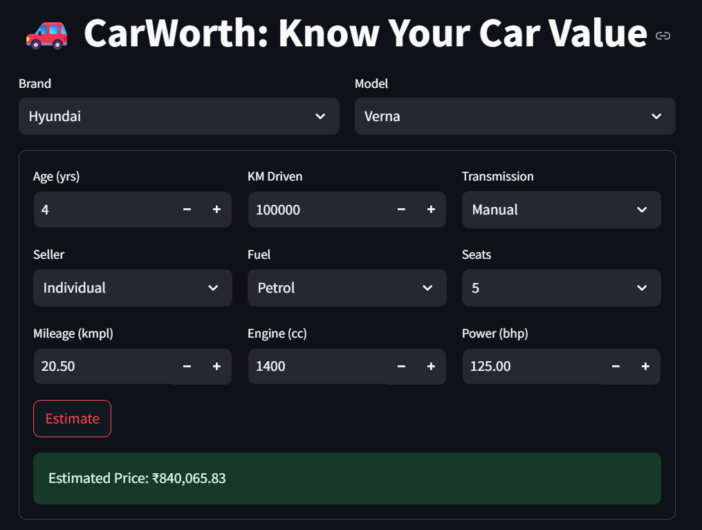

# CarWorth: Know Your Car Value

## 🚗 Overview

CarWorth: Price Prediction is a powerful tool designed to estimate car values based on various parameters such as brand, model, transmission, seats, and power (bhp). This project leverages advanced technology to provide accurate and real-time predictions, making it an essential resource for car buyers, sellers, and automotive enthusiasts.




## ✨ Features

Customizable Search: Select from a wide range of car brands (e.g., Maruti, Hyundai) and specify model, transmission, seats, and power (bhp).
Accurate Predictions: Utilizes machine learning algorithms to deliver precise car value estimates.
User-Friendly Interface: Intuitive design for easy navigation and quick results.


## 💻 Technologies Used

Machine Learning: Powers the predictive analytics for car pricing.
Python: Core language for development and data processing.
Data Analytics: Incorporates real-time market data for enhanced accuracy.


## 🛠️ Project Process

1. **Data Preparation**:
   Started with the cardekho_imputed dataset from CarDekho.
   Cleaned the data using the data_cleaning.ipynb file to handle missing values, outliers, and inconsistencies.

2. **Model Development**:

   Used the cleaned data in main_model.ipynb to build and train a machine learning model.
   Saved the trained artifacts as .joblib files: model.joblib, preprocessor.joblib, label_encoder_brand.joblib, and label_encoder_model.joblib.

3. **Web Application**:

   Developed a Streamlit web application with a user-friendly UI, utilizing the .joblib files for real-time price predictions based on user inputs (brand, model, etc.).

4. **Visualization**:

   The application is run using Streamlit, with the process demonstrated in a video showcasing data input to price estimation.


## 🛠️ Installation
1. **Clone the repository**:
   ```bash
   git clone https://github.com/anand738/CarWorth-Know-your-car-value.git

2. **Navigate to the project directory**:
   ```bash
   cd carworth-price-prediction

3. **Install the required dependencies:**:
   ```bash
   pip install -r requirements.txt

4. **Run the application:**
   ```bash
    python -m streamlit run app.py


## 🎯 Usage

Open the application in your browser.
Select the desired car brand, model, transmission type, number of seats, and power (bhp).
Click "Predict" to view the estimated car value.
